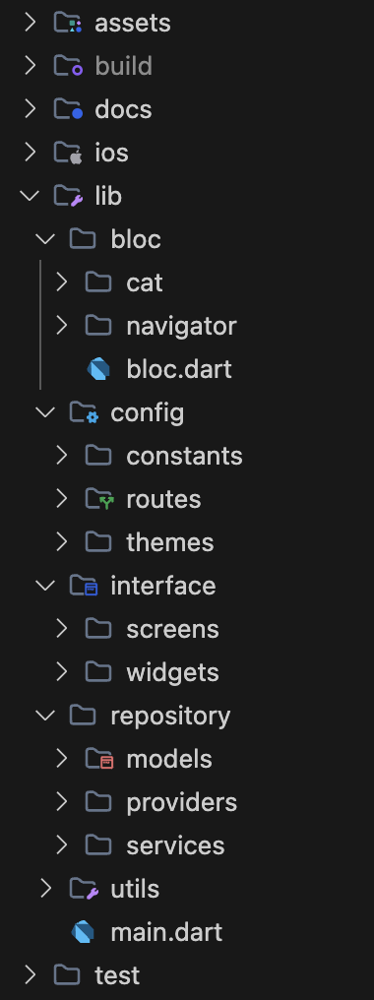
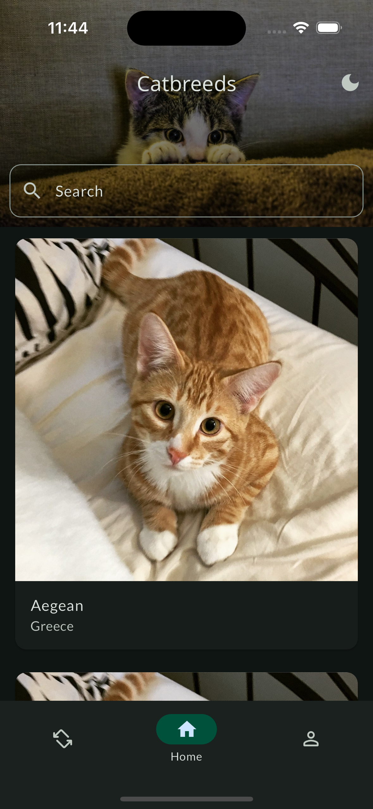
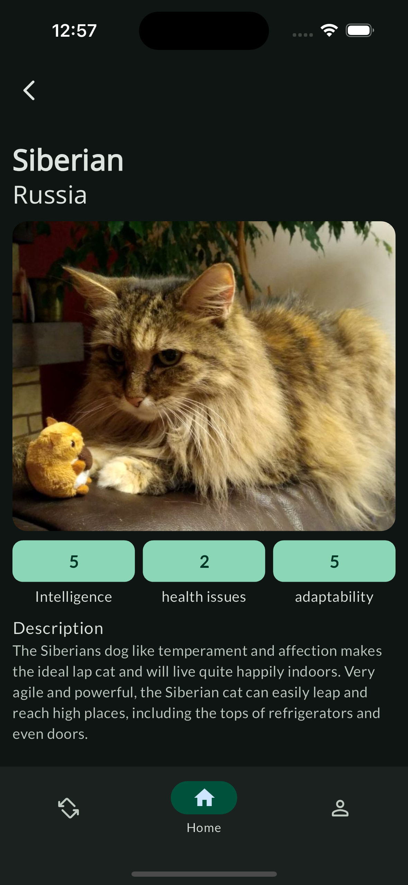
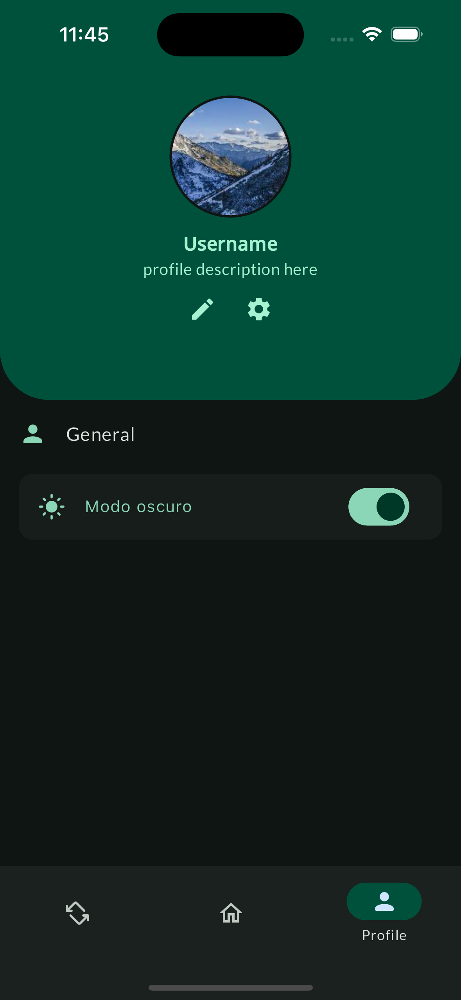
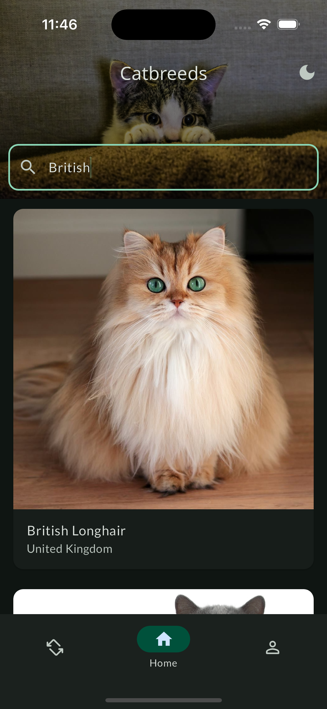
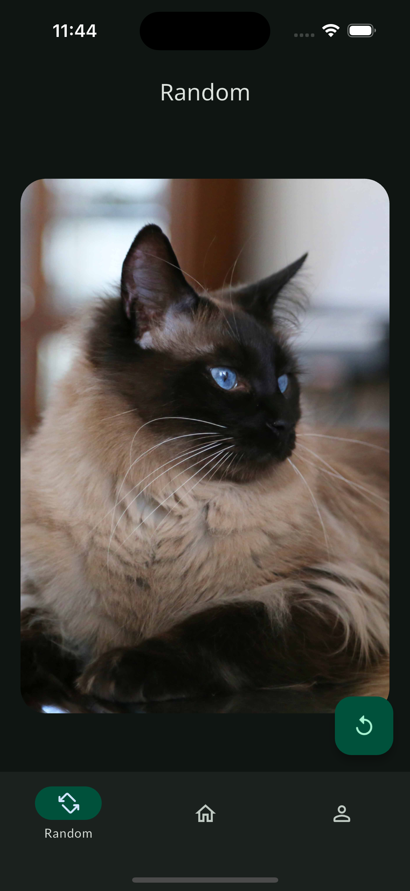
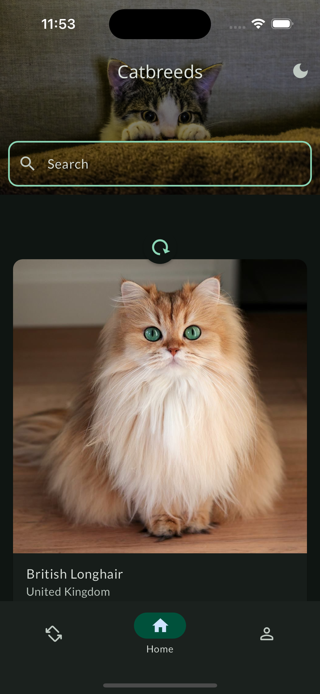

# CAT_APP
Proyecto de Flutter para mostrar el amor a los gatos, permitiendo encontrar nuevas razas y características de gatos. 

## Features
Este proyecto tiene como objetivo ayudarte a encontrar la raza de tu futuro gato. Para la realización de este proyecto se utilizaron las siguientes características y estándares de la industria.

### Clean Architecture
Es una arquitectura de software muy utilizada en Flutter, la cual nos permite desarrollar aplicaciones modulares, mantenibles y escalables al separar claramente las responsabilidades en capas independientes y bien definidas, para esto se crearon las siguientes capas que se pueden ver reflejadas en el árbol de directorios:



**Árbol de Directorios:**
- **bloc:** Los archivos encargados de la lógica de negocio de la app.
- **config:** configuraciones de enrutamiento, constantes y temas.
- **interface:** Encargado de la parte gráfica de la app `interface`, `widgets`.
- **repository:** Encargado de definir los `models`, administrar al bloc los `providers` y de conectarse a la API a través de los `services`.
- **utils:** Funciones y métodos que le brindan funcionalidades generales a la app.

### Paquetes
- **flutter_bloc:** Gestor de estados para manejar la lógica de negocio de la app.
- **equatable:** Facilita la comparación de objetos para determinar si son iguales, optimizando la gestión de los estados del BloC.
- **go_router:** Facilita el uso del Navegador 2.0
- **dio:** Librería HTTP optimizada en rendimiento, que permite una mejor configuración y manejo de los queries. 
- **google_fonts:** Facilita el uso de fuentes libre suministradas por Google.
- **shared_preferences:** Permite almacenar de forma permanente la preferencias del usuario en la app.
- **skeletonizer:** Facilita el uso de animaciones de carga.
- **flutter_dotenv:** Facilita el uso de variables de entorno.
- **rxdart:** Le agrega más características al uso de Stream.

## Usage

<div style="display: flex; flex-direction: row; justify-content: space-around;">
  <div style="text-align: center; margin: 10px;">
    
    <p>Home: Vista de razas de gatos</p>
  </div>
  <div style="text-align: center; margin: 10px;">
    
    <p>Detail: Vista de detalle de la raza</p>
  </div>
</div>

<div style="display: flex; flex-direction: row; justify-content: space-around;">
  <div style="text-align: center; margin: 10px;">
    
    <p>Profile: Perfil de usuario</p>
  </div>
  <div style="text-align: center; margin: 10px;">
    
    <p>Barra de búsqueda por razas</p>
  </div>
</div>

<div style="display: flex; flex-direction: row; justify-content: space-around;">
  <div style="text-align: center; margin: 10px;">
    
    <p>Random: Match gatuno</p>
  </div>
  <div style="text-align: center; margin: 10px;">
    
    <p>Refresh Indicator</p>
  </div>
</div>


## Installation
El proyecto fue diseñado para funcionar con las siguientes `dependencias` instaladas:
- Dart: 3.4.3
- DevTools: 2.34.3
- Flutter: 3.22.2
- VsCode.

Para poder instalar los paquetes utilizados en el proyecto, luego de tener las herramientas instaladas, se debe ejecutar el siguiente comando

```bash
flutter pub get
```

## Getting Started
Para iniciar el proyecto luego de tener todas las dependencias, se deben seguir los siguientes pasos:
1. Crear Archivo de variables de entorno en la carpeta raíz
   ```bash
    touch .env
   ```
2. Agregar `API_KEY` proporcionado para CatAPI al archivo de variables de entorno.
   ```yml
    API_KEY='your_api_key'
   ```
3. Conectar dispositivo / Iniciar simulador (IOS/Android).
4. Ejecutar comando de debug.
   ```bash
    flutter run
   ```
   

